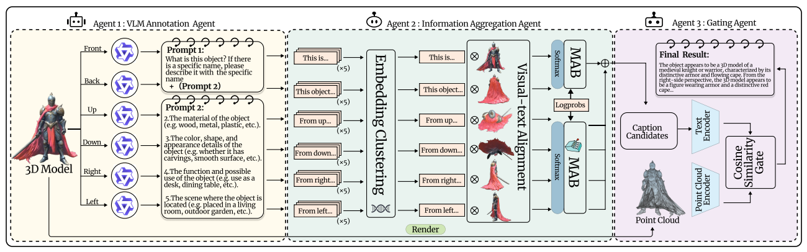
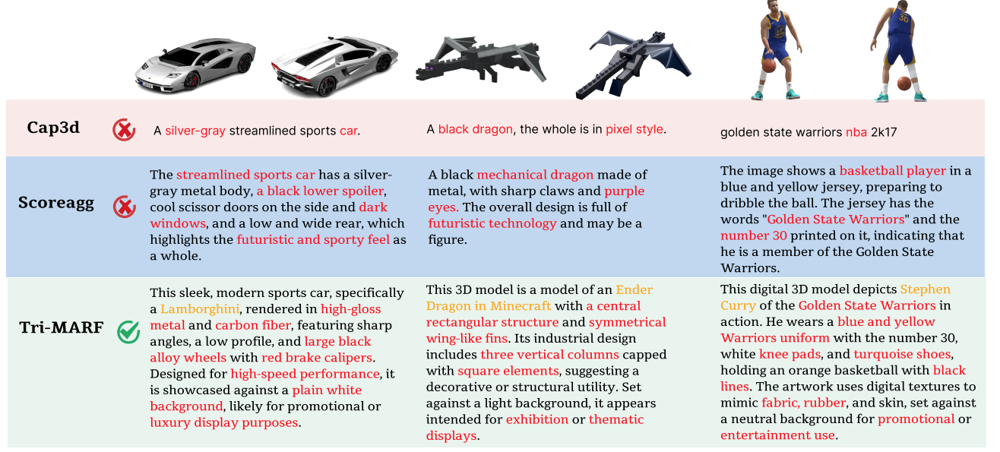

# 3D-Agent

## NeurIPS 2025 

> Official supplementary code release for **3D-Agent: Tri-Modal Multi-Agent Collaboration for Scalable 3D Object Annotation** (NeurIPS 2025).

[](https://arxiv.org/abs/2601.04404)

## Overview

**3D-Agent** introduces **Tri-MARF**, a tri-modal multi-agent framework for scalable 3D object annotation. The method combines:

- **multi-view 2D renders**,
- **textual candidate descriptions**, and
- **3D point-cloud geometry**

within a collaborative agent pipeline for high-quality 3D caption generation and filtering.

According to the public arXiv entry, the paper is titled **"3D-Agent: Tri-Modal Multi-Agent Collaboration for Scalable 3D Object Annotation"**, was submitted on **2026-01-07**, and lists **Accepted at NeurIPS 2025** in the comments field. citeturn836544view0

## Pipeline



The framework contains three specialized agents:

### Agent 1: VLM Annotation Agent
Generates candidate object descriptions from multiple rendered views using a vision-language model.

### Agent 2: Information Aggregation Agent
Clusters, deduplicates, and ranks candidate descriptions with language embeddings, visual-text alignment, and a multi-armed bandit (MAB) style aggregation strategy.

### Agent 3: Gating Agent
Uses 3D point-cloud features to verify and refine text candidates, suppressing visually plausible but geometrically inconsistent descriptions.

## Qualitative Results



The figure above highlights representative comparisons against alternative annotation pipelines.

## Repository Structure

```text
3D-Agent/
├── assets/
│   ├── pipeline_overview.png
│   └── qualitative_results.png
├── src/
│   ├── Bert_Deduplication.py
│   ├── Point_Gating.py
│   ├── VLM_preliminary_annotation.py
│   └── README.md
├── .env.example
├── .gitignore
├── CITATION.cff
├── examples_partial_annotation_results.json
└── README.md
```

## Included Modules

### `src/VLM_preliminary_annotation.py`
Core module for multi-view preliminary annotation with a VLM API. It:
- builds view-aware prompts,
- queries a VLM repeatedly for candidate responses,
- estimates confidence scores from token log-probabilities, and
- writes annotation outputs to JSON.

### `src/Bert_Deduplication.py`
Implements text-side response clustering and ranking, including:
- RoBERTa-based semantic deduplication,
- optional CLIP-weighted re-ranking, and
- response aggregation utilities.

### `src/Point_Gating.py`
Implements point-cloud-aware gating to align candidate captions with 3D geometry and filter inconsistent descriptions.

## Setup

Create a Python environment and install the dependencies required by your local pipeline. The provided code is a **supplementary code release**, not a one-command end-to-end training package.

A typical environment will need:

```bash
pip install torch torchvision transformers scikit-learn pillow requests numpy
```

Depending on your point-cloud backbone and evaluation stack, you may also need libraries such as:

- `open3d`
- `clip`
- custom 3D encoders / checkpoints

## API Configuration

Create a local environment file:

```bash
cp .env.example .env
```

Then set your key in `.env`:

```bash
OPENROUTER_API_KEY=your_openrouter_api_key
```

Please do **not** hard-code private keys in the source code before publishing the repository.

## Notes

- This release focuses on the **core algorithmic modules** used in the supplementary material.
- Some training assets, full data pipelines, checkpoints, and large-scale infrastructure components are not included in this lightweight release.
- You should adapt file paths, model loading, and point-cloud backbones for your local environment.

## Citation

```bibtex
@article{zhang20263dagent,
  title={3D-Agent: Tri-Modal Multi-Agent Collaboration for Scalable 3D Object Annotation},
  author={Zhang, Jusheng and Fan, Yijia and Wen, Zimo and Wang, Jian and Wang, Keze},
  journal={arXiv preprint arXiv:2601.04404},
  year={2026}
}
```

## Acknowledgement

This repository is prepared as a cleaned, GitHub-friendly supplementary release based on the provided code package and figures.
